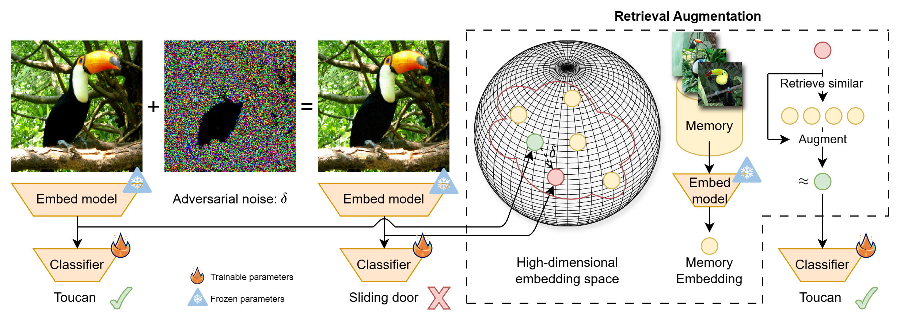
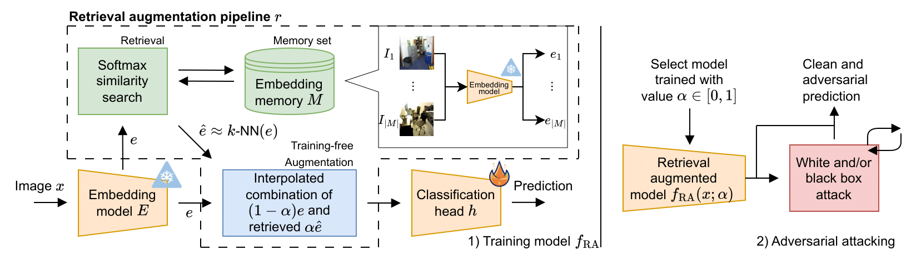

# Retrieval augmentation for Adversarial Robust Visual Classification

This is the official repository for "Retrieval augmentation for Adversarial Robust Visual Classification"

# 1. Installation
You can use Docker (1.1) or install manually (1.2).

Use of a GPU is highly recommended

## 1.1 Docker
See `docker/Dockerfile` for the image

## 1.2 Manual install
This repository was built with **Python 3.11** and PyTorch Fabric, not sure if it works on older versions

Run `pip install -r requirements.txt`

## 2.3 Datasets
This repo assumes local copies of the following datasets:
* ImageNet
* CIFAR-100
* GTSRB

# 2. Approach

# 3. Reproducability

This repository has three main components: 
1) Pre-computing image embeddings
2) Training/evaluating models
3) Attacking models

## 3.1 Feature embedding

`python src/embed.py --dataset [dataset] --model [model] --num-augmentations [num] --batch-size [num]`
